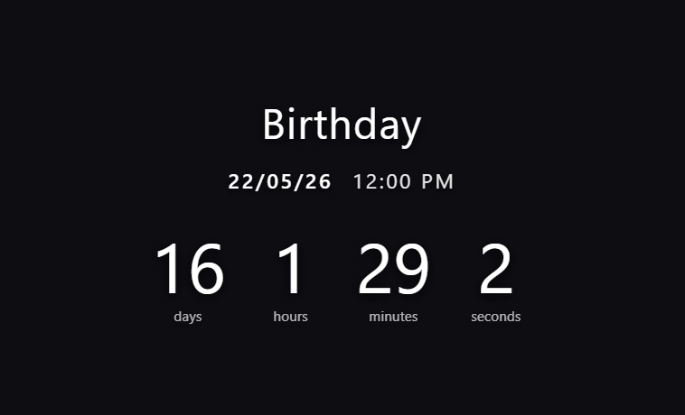

#  Lux Countdown

[](https://github.com/pathompuam/LuxCountdown/releases)
[](https://opensource.org/licenses/MIT)

**Lux Countdown** is a stylish and modern Desktop Widget application designed to help you keep track of every important event in your life. Developed by **Lux**.

## Download

You can download the latest version for Windows (.exe) from the **[Releases](https://github.com/pathompuam/LuxCountdown/releases)** page.

<p align="center">
  
  
</p>

## Key Features

- **Desktop Widget:** Runs as a floating widget on your desktop without cluttering the taskbar.
- **Position & Size Memory:** Remembers the last position and size you set; the app returns exactly where you left it on restart.
- **Custom Presets:** Create and manage multiple countdown events simultaneously.
- **Personalized Background:** Set your own background images for each event.
- **Run on Startup:** Option to have the app launch automatically when Windows starts.
- **Modern UI:** Beautiful icons from Lucide React and easy-to-read date formats.

## How to Use

1.  **Drag and Drop:** Click and hold the widget to move it anywhere on your screen.
2.  **Resizing:** Hover over the edges of the widget to drag and adjust the size as needed.
3.  **Settings:**
    - Click the **Gear (Settings)** icon on the widget or right-click the app icon in the **System Tray** (bottom-right corner).
    - In the settings view, you can:
        - Add new events (+).
        - Edit event names and dates.
        - Upload background images.
        - Toggle **Run on startup**.
4.  **System Tray:** The app icon in the bottom-right corner allows you to access settings or close the app anytime.

## Development

For developers who want to extend this project:

```bash
# Install dependencies
npm install

# Run in development mode
npm run dev

# Build the application
npm run build
```

## Tech Stack

- **Frontend:** React + TypeScript + Vite
- **Desktop Framework:** Electron
- **Icons:** Lucide React
- **Styling:** CSS3 (Custom Design)

---
Developed with ❤️ by **Lux and Gemini(XD)**
